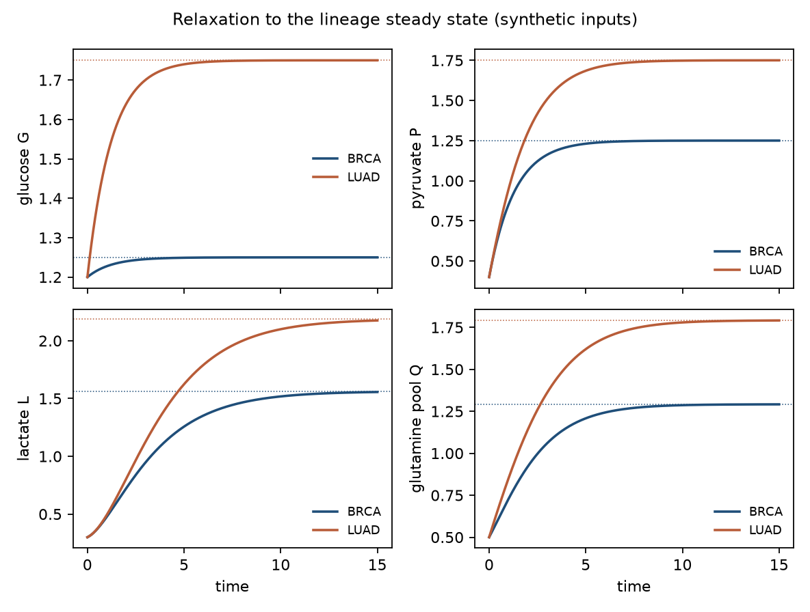
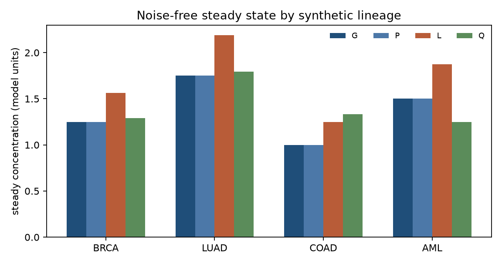
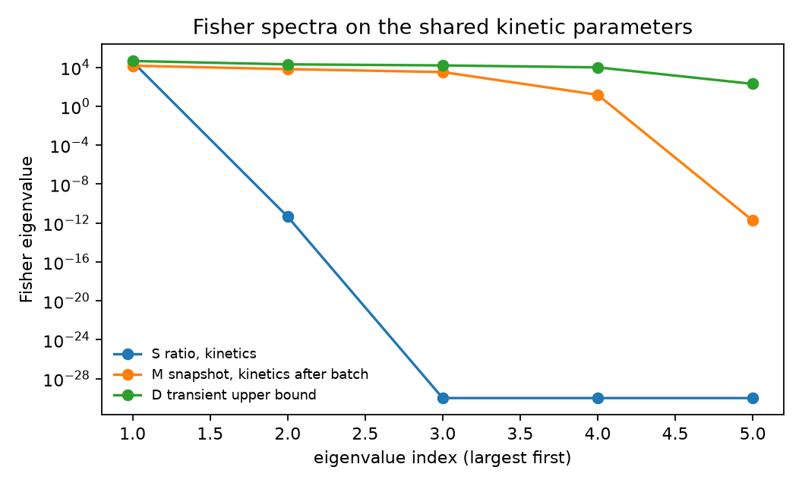
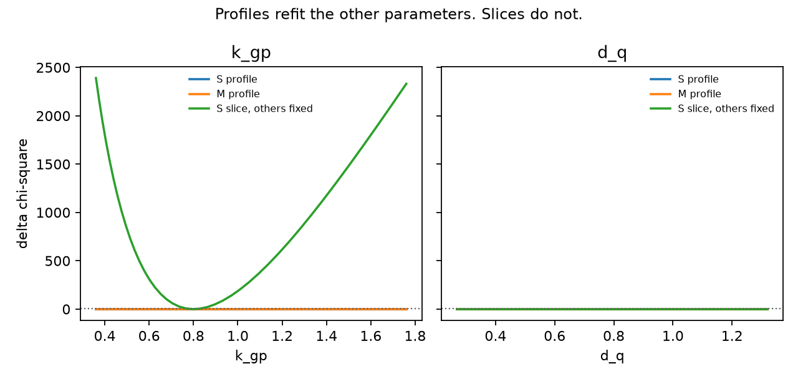
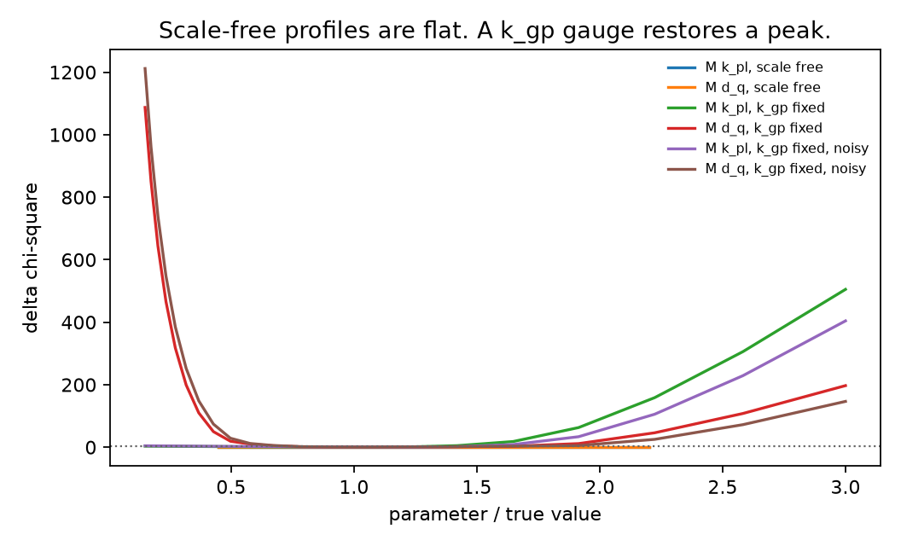

# Structural and Practical Identifiability of a Shared Metabolic Cancer ODE under Multi-Channel Noisy Observation Maps

**Thesis #9. Computational research thesis** (series label NP-01)  
**Author:** Kelechi Emeka Ogbonna  
**Correspondence:** kelechiogbonna300@gmail.com · https://github.com/cloudynirvana/thesis-09-ccle-metabolic-ode-identifiability  
**Date:** 21 September 2026  
**Format:** B.Sc. project chapters (Nile University style), written as a computational methods manuscript  
**Status:** In-silico identifiability on a declared synthetic surrogate. Not a cell-line fit. Not a clinical result.  
**Citation style:** numbered Vancouver. A `doi:` field appears only where Crossref returned the record.  
**DOI:** none for this document. Do not invent one.

---

## Title page

**STRUCTURAL AND PRACTICAL IDENTIFIABILITY OF A SHARED METABOLIC CANCER ODE UNDER MULTI-CHANNEL NOISY OBSERVATION MAPS**

BY

**KELECHI EMEKA OGBONNA**

A COMPUTATIONAL RESEARCH THESIS  
(IN-SILICO IDENTIFIABILITY STUDY)

SUBMITTED AS A CITEABLE MANUSCRIPT FOR JOURNAL / THESIS HANDOFF

PROJECT CONFLUENCE  
INDEPENDENT COMPUTATIONAL RESEARCH

SUPERVISOR: not appointed for this deposit

SEPTEMBER 2026

---

## Declaration

I, Kelechi Emeka Ogbonna, declare that this computational research thesis was carried out by me. The ranks, profiles and steady states reported here were produced by `sim/identifiability.py` at seed 20260921. They are not wet-lab measurements and not patient outcomes. No DOI, ORCID or journal acceptance was invented for this document.

_________________________     _______________________  
Kelechi Emeka Ogbonna         Date

---

## Abstract

Can a shared metabolic ODE recover unique (or practically unique) parameters from multi-channel metabolomics-style outputs, or does identifiability collapse under realistic noisy maps? The calculations use a four-state model for glucose, pyruvate, lactate and a glutamine-linked pool, with five shared rates. Four lineage input pairs are known constants. Schedule S observes the steady lactate/glucose ratio. Schedule M observes the four steady pools on the log scale, with a correlated residual and one loading per lineage.

The ratio does not depend on the inputs. Its Fisher rank is 1 of 5, and the glutamine clearance is invisible. Every coordinate profile on S is flat. A one-at-a-time slice, with the other rates frozen, makes the glucose rate look identified. That slice is not a profile.

Schedule M raises the profiled kinetic rank from 1 to 4. The remaining null direction is a common rescaling of all five rates, absorbed by the lineage loading. Because every rate lies on that ray, each coordinate profile on M is flat as well. The multi-channel map therefore does not return a practically unique parameter vector. It returns the rates up to scale. With the glucose rate held as a gauge, glutamine clearance has a closed profile on the scanned grid. The lactate production rate does not, on the noiseless scan: the confidence set stays open below 0.15 times the true value. A 31-point time course on one lineage, which a snapshot does not provide, restores rank 5 of 5.

The draws are synthetic. Chapter Four is not a CCLE fit. Research only. Not a medical device, not a dose, and not a cure.

---

## Keywords

structural identifiability; practical identifiability; profile likelihood; Fisher information; cancer metabolism; metabolomics; ordinary differential equations; lineage loading; observation map; synthetic surrogate; research only

---

## Table of Contents

DECLARATION  
ABSTRACT  
Table of Contents  
List of tables and figures  

CHAPTER ONE. INTRODUCTION  
1.1 Background to the study  
1.2 STATEMENT OF RESEARCH PROBLEM  
1.3 JUSTIFICATION OF STUDY  
1.4 AIM AND OBJECTIVES OF THE STUDY  
1.5 SIGNIFICANCE OF THE STUDY  
1.6 SCOPE OF THE STUDY  

CHAPTER TWO. LITERATURE REVIEW  
2.1 Shared metabolic kinetics as a model class  
2.2 What a snapshot panel can and cannot see  
2.3 Structural rank, profiles, and sloppy spectra  
2.4 Identifiable combinations  

CHAPTER THREE. MATERIALS AND METHODS  
3.1 Design  
3.2 Right-hand side  
3.3 Parameters and lineage inputs  
3.4 Observation schedules  
3.5 Fisher information  
3.6 Profiles, slices, and a scale gauge  
3.7 What was not done  

CHAPTER FOUR. RESULTS  
4.1 Steady states  
4.2 The ratio is one number  
4.3 The snapshot loses a scale  
4.4 Profiles against slices  
4.5 Time-course upper bound  

CHAPTER FIVE. DISCUSSION, CONCLUSION AND RECOMMENDATION  
5.1 Discussion  
5.2 Conclusion  
5.3 Recommendation  

REFERENCES  
DISCLAIMER  

---

## List of tables and figures

**Table 3-1.** Shared rates used to generate the surrogate.  
**Table 3-2.** Known lineage inputs.  
**Table 3-3.** Observation schedules.  
**Table 4-1.** Noise-free steady state.  
**Table 4-2.** Fisher ranks.  
**Table 4-3.** Profile calls on the scanned grids.  
**Table 4-4.** Local relative Cramér-Rao sketches where the kinetic block has full rank.

**Figure 4-1.** Relaxation to steady state under two input pairs.  
**Figure 4-2.** Noise-free steady levels by lineage label.  
**Figure 4-3.** Fisher spectra of the kinetic block.  
**Figure 4-4.** Coordinate profiles compared with frozen slices.  
**Figure 4-5.** Snapshot profiles with the scale free, and with kgp fixed.

Figures are computational diagnostics from seed 20260921. They are not measured metabolite panels.

---

# CHAPTER ONE

## 1.0 INTRODUCTION

### 1.1 Background to the study

Cancer incidence figures set a reason to model metabolism. They are not rate constants. GLOBOCAN 2022, published in 2024, estimates a large global burden across 36 cancers in 185 countries [1]. Reprogramming of cellular energetics is one of the later hallmarks in the Hanahan and Weinberg list [2]. The biochemical literature behind that sentence is older than the list. Warburg described aerobic glycolysis in cancer cells in 1956 [3]. Vander Heiden, Cantley and Thompson restated the point as a biosynthetic requirement of proliferation, not as a single enzyme defect [4]. DeBerardinis and Chandel review the same territory as a network: glycolysis, the tricarboxylic acid cycle, and nutrient uptake [5]. Pavlova and Thompson treat altered metabolism as a set of recurring features rather than a private pathway of one tumour type [6]. Glutamine supply is part of that recurrence [7].

Cell-line panels were built so that some of this variation could be compared under a shared assay. The Cancer Cell Line Encyclopedia began as a genomic and pharmacological resource [8]. Later releases widened the molecular annotation [9]. Li and colleagues then published a metabolomic layer: hundreds of metabolites in hundreds of lines, with lineage as an organising variable [10]. That layer is cross-sectional. A line contributes a metabolite vector, not a dense time course of a pathway.

Mathematical oncology often writes a pathway as an ordinary differential equation and then simulates it [11]. Identifiability theory asks a prior question. Given an output map, is the parameter vector determined by perfect data [12]? Given noise, a finite sample, and nuisance parameters, does a confidence set for each coordinate stay bounded [13,14]?

Thesis #7 asks a different question, about a frozen three-state model in ATP, ROS and glucose, with phytochemical and nanocarrier symbols treated as known forcings [15]. The ODE in the present work has none of those forcings, no tipping scalar, and no ATP or ROS state. The object here is a multi-channel steady map with lineage loadings. The 2022 Nile University wet-lab project on *Carica papaya* leaf-extract silver nanoparticles is a separate study [16].

### 1.2 STATEMENT OF RESEARCH PROBLEM

Can a shared metabolic ODE recover unique (or practically unique) parameters from multi-channel metabolomics-style outputs, or does identifiability collapse under realistic noisy maps?

The working form of that question is narrow. Five rates are shared. Four lineage input pairs are known. One schedule sees only the steady lactate/glucose ratio. The other sees four steady pools, corrupted by a correlated residual and a loading that is constant across pools inside a lineage. Collapse, if it happens, has to be read off the rank and the profiles of this pair. It is not a statement about every metabolic model [12,13].

A familiar way to miss the question is to freeze four rates, move the fifth, watch the fit worsen, and call the fifth identified. That path is a slice. A profile refits the other parameters, including the loadings [13]. Another miss is to treat a rise in rank as a point estimate for every coordinate. Rank 4 in five dimensions still leaves a curve of equally good parameters [12,13].

### 1.3 JUSTIFICATION OF STUDY

Steady metabolite levels are what a panel assay returns. They are also a harsh observation map for a kinetic model. A linear pool at steady state remembers ratios of rates more readily than it remembers time [17]. If the assay also carries a multiplicative loading, shared by every channel in a sample, absolute scale can leave the likelihood entirely. The justification for the study is that this combination is easy to ignore when a model is scored on a single summary.

Cobelli and DiStefano separated structural identifiability from the numerical trouble of a finite experiment [17]. Jacquez and Greif pressed the same distinction into sampling design: a parameter can be structurally present and still be poorly estimable on the grid one actually has [18]. Leek and colleagues showed how batch structure in high-throughput data can dominate the biological contrast if it is left unmodelled [19]. Gutenkunst and co-authors showed a further split inside a full-rank Fisher matrix. Eigenvalues can span many orders, so a formally identifiable model still has directions in which the data barely move [20].

Those results are general. They do not by themselves say what this four-state map does. The study is the calculation: algebra of the steady state, Fisher rank under the two schedules, and profiles that either close or stay flat [13,14]. An earlier draft filed under project-confluence stated that a real six-channel CCLE calibration lifted an identifiable count from 7 of 17 parameters to 15 of 17 [21]. The script and the metabolomics file behind those two fractions are not in this repository. The fractions are not results of Chapter Four.

The study is not justified as a device, a dosing rule, or a claim that any lineage label is a treated cohort [22,23].

### 1.4 AIM AND OBJECTIVES OF THE STUDY

The aim is to determine whether the five shared rates of the model in Section 3.2 are structurally and practically identifiable from the single-summary schedule and from the multi-channel snapshot.

The objectives are:

1. Solve the steady state in closed form and record which rates the lactate/glucose ratio can see.
2. Compute Fisher ranks for the ratio, for the four-channel snapshot with loadings profiled out, and for a time-course upper bound.
3. Draw coordinate profiles, with the remaining rates refitted, and contrast them with slices that freeze those rates.
4. Repeat the snapshot profiles with one rate held fixed, so the scale symmetry is gauged rather than estimated.
5. Keep the surrogate label on every numerical claim, and keep clinical translation outside the aim.

Non-aims. Fitting the rates to a downloaded metabolomics matrix. Editing the vector field until the scale symmetry disappears and then reporting the edited model as if it were the original. Reading a Fisher rank as a treatment effect.

### 1.5 SIGNIFICANCE OF THE STUDY

The useful product is a distinction among three objects that are often collapsed in a calibration paragraph. A summary ratio, a loaded snapshot, and a time course are not interchangeable designs [18]. On this ODE they do not even share a null space. That fact is local to the equations in Section 3.2. It is still the sort of fact a later worker can check without believing a clinical sentence.

There is a second distinction inside the snapshot. Structural rank 4 means the data determine a four-dimensional quotient. It does not mean each printed rate has a finite confidence interval [13,20]. The profiles are there so that a full-rank misreading has a figure to fail against. Saltelli and colleagues ask models to expose the assumptions on which a number depends [22]. May's warning is the same demand, aimed at biology that borrows equations more readily than it audits them [23].

What the significance is not: a survival difference, a metabolite biomarker threshold, or a reason to treat a cell line [1,22].

### 1.6 SCOPE OF THE STUDY

In scope. The linear four-state ODE. Known positive inputs for four labels (BRCA, LUAD, COAD, AML). Steady observations. A synthetic correlation and a scalar loading. Gaussian Fisher information. Profile likelihood on three coordinates, plus a gauged repeat for two of them. One BRCA time course with independent noise, reported as an upper bound.

Out of scope. Real CCLE or DepMap matrices [10,24]. Unknown initial conditions in the steady-state schedules. A global differential-algebra certificate. Immune states, drug inputs, and any map from these rates to a dose. Regulatory use.

---

# CHAPTER TWO

## 2.0 LITERATURE REVIEW

### 2.1 Shared metabolic kinetics as a model class

A shared-rate model is a hypothesis that lineage differences sit in the inputs, or in a nuisance shift, rather than in a private parameter vector for every line. The hypothesis can be false. It is still the hypothesis under test when one ODE is offered for several lineages [5,6]. The states chosen here are a teaching reduction of that hypothesis: extracellular or intracellular glucose, a pyruvate pool, lactate, and a glutamine-linked pool that also receives a pyruvate branch. HK2, PKM2, LDHA and glutaminase do not appear as estimated enzyme abundances. Naming them would suggest a protein data set this repository does not contain [10].

Mass-action linear pools are not a description of saturation kinetics. They are the smallest class in which a scale symmetry can be written by hand and then recovered numerically [12,25]. If the symmetry is already fatal in the linear case, a Michaelis-Menten elaboration will not remove it by adding parameters. It can only hide it.

### 2.2 What a snapshot panel can and cannot see

Li et al. measured metabolites across the CCLE collection and organised the resulting variation by lineage and by culture medium, among other factors [10]. The design implication for an ODE is blunt. The likelihood sees a cloud of vectors, one per line, not ∂x/∂t. Time constants that cancel at equilibrium are not in that cloud [17].

Loadings and batch shifts are ordinary features of high-throughput chemistry, not a special defect of one portal [19]. A loading that multiplies every metabolite in a line is a particularly simple nuisance. On the log scale it is an intercept. Intercepts are identifiable from the data only jointly with whatever else moves all channels together. In the model below, a common rate multiplier is exactly such a move.

DepMap distributes CCLE-related matrices through a portal that, at the time of this deposit, did not return the metabolomics file to a plain download [24]. The correlation used here is therefore declared, not estimated. Section 3.1 states that once. Using a published correlation from Li et al. without the file would have been a different, and still indirect, choice. It was not made.

### 2.3 Structural rank, profiles, and sloppy spectra

Bellman and Åström defined structural identifiability as uniqueness of the parameter in the input-output map, noise aside [12]. Ljung and Glad gave a global rank test for rational models [25]. Villaverde, Barreiro and Papachristodoulou survey how often that ideal is replaced, in systems biology, by a local numerical test [26]. This thesis is in the second group. The Fisher matrix at one parameter value is a local calculation. A zero eigenvalue is evidence of a local null direction. It is not, by itself, a global classification of every equivalent parameter in the positive orthant [25,26].

Practical identifiability is about the confidence set. Raue and colleagues use the profile likelihood for partially observed biological ODEs [13]. Fix one coordinate. Re-optimise the others. Then see whether chi-square stays above a threshold at both ends of a scan. Kreutz, Raue, Kaschek and Timmer discuss the same object as a way to separate a flat structural direction from a shallow statistical one [27]. A set that hits the edge of the scan is not certified as infinite. It is not certified as bounded either [13].

Sloppiness is a statement about eigenvalues, not about a single zero. Gutenkunst et al. found spectra in which each successive eigenvalue drops by a large factor, across models that were regarded as fitted [20]. Transtrum, Machta and Sethna trace the geometry behind that pattern: the chi-square surface is thin in some directions and long in others [28]. A condition number near 103 is not their most extreme case. It is already enough to stop a reader treating every diagonal standard error as equally meaningful.

Miao, Xia, Perelson and Wu collect the nonlinear theory and warn that output choice changes the identifiable set even when the vector field is held fixed [29]. That warning is the design of Chapter Three. The vector field does not change between schedules. The output map does.

### 2.4 Identifiable combinations

When a coordinate is not identifiable, a function of several coordinates may still be. Eisenberg and Hayashi develop subset profiling for that situation [30]. The ratio schedule in this thesis is the extreme case: one combination, four free directions. The snapshot is the intermediate case: the likelihood is constant when all five rates scale together, and it is not constant on a generic four-dimensional slice transverse to that ray.

Raue, Karlsson, Saccomani, Jirstrand and Timmer compare structural methods with profile-based practical checks [31]. The comparison supports a limited claim. Agreement between a hand-derived symmetry and a numerical null vector is stronger than either piece alone. Disagreement would have meant a bug in the Jacobian or a mistake in the algebra. Chapter Four records the agreement for this model. A DAISY-style global certificate was not run [32].

---

# CHAPTER THREE

## 3.0 MATERIALS AND METHODS

### 3.1 Design

The channel correlation, the lineage loadings, and the replicate draws are a synthetic surrogate. The CCLE metabolomics file was not downloaded, and no cell-line measurement enters the likelihood.

The generator is fixed. Seed 20260921. Four lineage labels. Six replicates each. Shared parameter

θ = (kgp, kpl, kpq, dl, dq) = (0.80, 0.50, 0.30, 0.40, 0.60).

Inputs are known. They are not random effects and not clinical covariates. The noise model differs by schedule, as specified in Section 3.4. Software is `sim/identifiability.py`. Numerics use finite differences on the closed-form steady state, except for the time-course schedule, which is integrated.

### 3.2 Right-hand side

States are glucose G, pyruvate P, lactate L, and a glutamine-linked pool Q. For a lineage with inputs uG and uQ,

dG/dt = uG - kgp G

dP/dt = kgp G - (kpl + kpq) P

dL/dt = kpl P - dl L

dQ/dt = uQ + kpq P - dq Q

All five rates are positive. The unique steady state is

G* = uG / kgp

P* = uG / (kpl + kpq)

L* = kpl uG / (dl (kpl + kpq))

Q* = (uQ + kpq uG / (kpl + kpq)) / dq

The single-summary target is s = L*/G*:

s = kgp kpl / (dl (kpl + kpq)).

The inputs cancel. So does dq. At the generating value, s = 1.25 in every lineage.

A scale symmetry sits in the four-channel steady map. Replace θ by λθ with λ > 0. Every steady concentration is divided by λ. On the log scale that is a shift of −log(λ), identical in all four channels. A lineage loading can cancel the shift. The mean snapshot is therefore unchanged. The symmetry is the reason a coordinate-wise profile can be flat even after the rank has risen.

### 3.3 Parameters and lineage inputs

**Table 3-1.** Generating rates. Model units. Not fitted to an assay.

| Symbol | Role in the vector field | Value |
| --- | --- | ---: |
| kgp | Glucose clearance into the pyruvate branch | 0.80 |
| kpl | Pyruvate to lactate | 0.50 |
| kpq | Pyruvate into the glutamine-linked pool | 0.30 |
| dl | Lactate clearance | 0.40 |
| dq | Glutamine-pool clearance | 0.60 |

**Table 3-2.** Known inputs by label. The labels are not cohorts.

| Label | uG | uQ |
| --- | ---: | ---: |
| BRCA | 1.00 | 0.40 |
| LUAD | 1.40 | 0.55 |
| COAD | 0.80 | 0.50 |
| AML | 1.20 | 0.30 |

Initial conditions matter only for the time-course schedule: (G, P, L, Q)(0) = (1.20, 0.40, 0.30, 0.50). Steady-state schedules do not use them.

### 3.4 Observation schedules

**Table 3-3.** Schedules compared on the same θ.

| Code | What is recorded | Noise | Nuisance |
| --- | --- | --- | --- |
| S | log s, six replicates in each lineage | Independent, sd 0.08 | None |
| M | log(G*, P*, L*, Q*), six replicates | Correlated, marginal sd 0.15 | One loading per lineage |
| D | All four states at 31 times on [0, 15], BRCA only | Independent, 5% of the level plus 0.02 | None |

Schedule D is an upper bound on information for this vector field. It is not a metabolomic panel and not a claim that such a time course exists in CCLE.

The correlation on schedule M is constant:

R = [[1.00, 0.55, 0.45, 0.15], [0.55, 1.00, 0.60, 0.20], [0.45, 0.60, 1.00, 0.10], [0.15, 0.20, 0.10, 1.00]]

Covariance is (0.15)2 R. Its eigenvalues are positive (smallest 0.371), so the whitening used in the Fisher matrix is defined. Loadings on noisy schedule M are drawn once per lineage from a normal distribution with mean 0 and sd 0.20, then shared by the four channels and the six replicates. The noiseless profiles set every loading to zero. The Fisher matrix treats loadings as unknown constants, not as random effects. Profiling them out is the Schur complement of the kinetic block.

### 3.5 Fisher information

Observations are modelled as Gaussian on the scale given in Table 3-3. The mean depends on θ through the steady state, or through the integrated trajectory for schedule D. Sensitivities are one-sided finite differences. The relative step is 10−6 at steady state and 10−5 along the trajectory.

Numerical rank counts eigenvalues above 10−8 times the largest eigenvalue. A second, stricter count, called practical rank in the output file, uses 10−3 times the largest eigenvalue. Both cuts are declared before looking at a scientific conclusion. They are not estimated from the data. Where the kinetic block has full numerical rank, the diagonal of the inverse matrix is reported as a local Cramér-Rao sketch under the Gaussian model. The sketch is not a posterior and not a global interval [18,20].

For schedule M the reported kinetic spectrum is the Schur complement after the four loadings are removed. The full nine-parameter matrix is stored as well.

### 3.6 Profiles, slices, and a scale gauge

A profile fixes one rate on a geometric grid, refits the others inside explicit bounds, and records the weighted residual sum of squares [13]. The grid for schedules S and M runs from 0.45 to 2.2 times the generating value, at 13 nodes. The gauged grid runs from 0.15 to 3.0 times that value, at 21 nodes. Bounds on free rates are those in the script (lower edges 0.02 or 0.05, upper edges 3 or 4). Loadings, when estimated, lie in [−1.5, 1.5].

The chi-square threshold for one interesting parameter is 3.841. A profile is called flat when the chi-square spread on the grid is below 0.5. It is called identifiable on the grid when both endpoints exceed the threshold. Otherwise it is called practically non-identifiable on that scan. The third label includes sets that are merely open at one edge. Chapter Four says which case occurred.

A slice is not a profile. It moves one rate and leaves the others at the generating value. Slices are reported because they reproduce the false confidence of a one-parameter plot.

The gauge fixes kgp = 0.80 and profiles kpl or dq. It answers a different question: if scale were known from elsewhere, would the remaining snapshot still fail to bound these two rates? The gauge is not estimated from schedule M.

Noiseless data equal the model mean. Noisy data are one draw at the seed above. One draw cannot stand in for a sampling distribution of the profile [13,27].

### 3.7 What was not done

Real CCLE values were not fitted. Enzyme concentrations were not states. The correlation was not learned. Global identifiability software was not run [32]. Initial conditions were known on schedule D and irrelevant on S and M. No dose, schedule, or clinical threshold was computed.

---

# CHAPTER FOUR

## 4.0 RESULTS

### 4.1 Steady states

Integration from the initial condition in Section 3.3 approaches the closed form. Figure 4-1 shows BRCA and LUAD. Dotted lines are the analytic steady levels. The terminal values agree with those levels. Table 4-1 lists all four labels. The ratio L*/G* is 1.25 everywhere, as the cancellation in Section 3.2 requires.

**Table 4-1.** Noise-free steady state at the generating rates. Four decimals from `sim/results.json`.

| Label | G* | P* | L* | Q* | L*/G* |
| --- | ---: | ---: | ---: | ---: | ---: |
| BRCA | 1.2500 | 1.2500 | 1.5625 | 1.2917 | 1.25 |
| LUAD | 1.7500 | 1.7500 | 2.1875 | 1.7917 | 1.25 |
| COAD | 1.0000 | 1.0000 | 1.2500 | 1.3333 | 1.25 |
| AML | 1.5000 | 1.5000 | 1.8750 | 1.2500 | 1.25 |

**Figure 4-1.** Solid curves are the ODE. Dotted lines are steady levels. The horizontal axis is model time. The figure is a check on the integrator, not an observed time course.

**Figure 4-2.** Noise-free means. Lineage differences in the figure are the input pairs in Table 3-2, seen through the shared rates.

### 4.2 The ratio is one number

Schedule S has Fisher rank 1 of 5. Practical rank, under the 10−3 cut, is also 1. The leading eigenvalue is 3.727×104. The next is 4.479×10−12, and the rest are numerical zeros. The condition number of a rank-1 block is 1. The column for dq is the exact zero predicted by the formula for s. The other three near-null directions are the trades that hold s fixed, for example raising kgp and dl by the same factor.

Coordinate profiles agree with that rank. On S, the chi-square spread for kgp, kpl and dq is at most 2.073×10−9 (noisy kgp). Most spreads are far smaller. The script's flatness cut is 0.5. These profiles sit many orders below it, on both the noiseless mean and the noisy draw. Refitting compensates. The ratio does not determine a unique θ [13,30].

The slice does the opposite. With the other rates frozen, the kgp slice on S has chi-square spread 2391 and is closed on its grid. The dq slice on S has spread 0, because dq does not enter s even when nothing else is allowed to move. A frozen slice can therefore look decisive for a rate the profile has already shown to be free. That is the single-summary failure mode in this model.

### 4.3 The snapshot loses a scale

Schedule M, with four loadings in the parameter vector, has full-matrix rank 8 of 9. Practical rank on that matrix is 7. The smallest nonzero eigenvalue is 14.92 and falls just under the practical cut. After the loadings are profiled out, the kinetic rank is 4 of 5. Practical rank at the 10−3 cut is also 4. Profiled eigenvalues are 1.474×104, 6.585×103, 3.278×103, 15.11 and 1.768×10−12. The condition number of the four-dimensional block is 975.8. The fourth eigenvalue, 15.11, is only slightly above 10−3 times the largest (14.74). A cut at 10−2 would have called the practical rank 3. The structural zero is not ambiguous: it lies twelve orders below the smallest retained eigenvalue.

The weakest profiled direction has absolute components 0.653, 0.408, 0.245, 0.327 and 0.490 on (kgp, kpl, kpq, dl, dq). Those are the components of θ/‖θ‖ through three decimals. The numerical null space is the scale symmetry of Section 3.2, not an accidental collinearity of two rates.

Because the ray touches every coordinate, a profile of any single rate can slide along the ray, with the loading absorbing the log shift. Table 4-3 shows the consequence. Every schedule M profile without the gauge is flat. The largest chi-square spread among them is 2.075×10−12. Multi-channel data removed the total blindness of the ratio. They did not produce a practically unique vector [13,20].

Relative Cramér-Rao values are omitted for S and for ungauged M. The kinetic block is singular there, so the inverse is not a variance.

**Figure 4-3.** Kinetic spectra. Schedule S is dominated by one eigenvalue. Schedule M, after the loading complement, keeps four. Schedule D keeps five. Vertical gaps inside a full-rank spectrum are the sloppiness warning of Gutenkunst et al. [20].

**Table 4-2.** Fisher summary. Practical rank uses the factor 10−3.

| Schedule | Block | Rank | Practical rank | Condition of the retained block |
| --- | --- | ---: | ---: | ---: |
| S | 5 rates | 1 / 5 | 1 | 1 |
| M | 5 rates + 4 loadings | 8 / 9 | 7 | 1013 |
| M | 5 rates, loadings profiled out | 4 / 5 | 4 | 975.8 |
| M | 4 rates, kgp fixed, loadings profiled out | 4 / 4 | 4 | 973.0 |
| D | 5 rates, BRCA time course | 5 / 5 | 5 | 225.6 |

### 4.4 Profiles against slices

**Table 4-3.** Profile calls. Intervals are the scanned nodes whose delta chi-square stays within 3.841 of the minimum, rounded to three decimals from `sim/results.json`. Spreads below 10−8 are written in scientific notation so they are not confused with a peak.

| Profile | Call | Interval on the grid | Chi-square spread |
| --- | --- | --- | ---: |
| S, kgp, noiseless | flat | 0.360 to 1.760 | 1.99×10−17 |
| S, kgp, noisy | flat | 0.360 to 1.760 | 2.073×10−9 |
| S, kpl, noiseless | flat | 0.225 to 1.100 | 1.256×10−17 |
| S, kpl, noisy | flat | 0.225 to 1.100 | 9.138×10−12 |
| S, dq, noiseless | flat | 0.270 to 1.320 | 0 |
| S, dq, noisy | flat | 0.270 to 1.320 | 0 |
| M, kgp, noiseless | flat | 0.360 to 1.760 | 9.326×10−24 |
| M, kgp, noisy | flat | 0.360 to 1.760 | 3.979×10−13 |
| M, kpl, noiseless | flat | 0.225 to 1.100 | 7.925×10−25 |
| M, kpl, noisy | flat | 0.225 to 1.100 | 2.075×10−12 |
| M, dq, noiseless | flat | 0.270 to 1.320 | 4.22×10−26 |
| M, dq, noisy | flat | 0.270 to 1.320 | 1.862×10−12 |
| M, kgp fixed, kpl, noiseless | open on the low side | 0.075 to 0.611 | 505 |
| M, kgp fixed, kpl, noisy | closed on the grid | 0.159 to 0.709 | 404 |
| M, kgp fixed, dq, noiseless | closed on the grid | 0.468 to 0.989 | 1087 |
| M, kgp fixed, dq, noisy | closed on the grid | 0.468 to 0.989 | 1212 |

Generating values are kgp = 0.80, kpl = 0.50 and dq = 0.60. The open kpl interval starts at the first gauged node, 0.075, which is 0.15 times 0.50. At that node the noiseless delta chi-square is 3.414, still under 3.841. The set is not flat. Spread 505 means the high side rises sharply (the next stored node, 0.709, already has delta chi-square 4.919). The low side does not clear the threshold inside the scan. The local Gaussian sketch in Table 4-4, a relative standard error of 0.273 for kpl, does not capture that asymmetry [27,28].

The noisy kpl profile does close, on 0.159 to 0.709. Its minimum on the grid is not at 0.50. One draw moved the valley and cut off the shoulder. That is a property of this seed, not a reason to prefer noisy design points over the mean [13].

With kgp fixed, dq is closed on both the noiseless and the noisy scan. The stored interval is 0.468 to 0.989 against a generating value of 0.60. The gauge Fisher block has rank 4 of 4 and condition number 973.0. Relative Cramér-Rao sketches for (kpl, kpq, dl, dq) are 0.273, 0.453, 0.273 and 0.224 (Table 4-4). Even the gauged quotient is only moderately pinned at this noise level and this replicate count. kpq is the loosest of the four.

**Table 4-4.** Relative local standard-error sketches, sd(θj)/θj, only where that block is full rank.

| Block | kgp | kpl | kpq | dl | dq |
| --- | ---: | ---: | ---: | ---: | ---: |
| M, kgp fixed | gauge | 0.273 | 0.453 | 0.273 | 0.224 |
| D, time course | 0.0125 | 0.0709 | 0.122 | 0.0848 | 0.0619 |

Slices on M remain misleading in the same way as on S. The frozen kgp slice has spread 1011. The frozen dq slice has spread 711. Both are closed on their grids. Both would be read as identification if the profile were not plotted beside them.

**Figure 4-4.** Delta chi-square against the scanned value. The horizontal dotted line is 3.841. Flat curves are profiles. Peaked curves include the S slice for kgp, which freezes the compensating rates.

**Figure 4-5.** Ungauged snapshot profiles stay on the axis. Fixing kgp produces a peak. The noiseless kpl peak is still open on the left of this plot.

### 4.5 Time-course upper bound

Schedule D observes the whole state on a time grid, with independent noise and no loading. Rank is 5 of 5. Practical rank is 5. The condition number is 225.6 (Table 4-2). Eigenvalues run from 4.516×104 down to 200.2. Relative Cramér-Rao sketches are 0.0125, 0.0709, 0.122, 0.0848 and 0.0619 for (kgp, kpl, kpq, dl, dq) (Table 4-4).

The time course identifies the scale because the decay rates are the eigenvalues of the linear system, and a trajectory sees them. A steady panel does not. Schedule D is not evidence that a metabolomics snapshot is secretly a time course. It is evidence that the vector field itself is not the sole source of the null direction in schedule M.

---

# CHAPTER FIVE

## 5.0 DISCUSSION, CONCLUSION AND RECOMMENDATION

### 5.1 Discussion

The question in Section 1.2 has a direct answer on this ODE. A shared parameter vector is not recovered as a point from the multi-channel snapshot. Identifiability does collapse relative to practical uniqueness of θ. It does not collapse all the way back to the ratio. The ratio leaves one combination. The snapshot leaves a one-parameter scale freedom and a four-dimensional quotient whose smallest retained eigenvalue is sensitive to the practical cut.

That split matters for how a calibration is described. "Five rates were fitted to four metabolites across lineages" can be a true sentence about an optimiser and a false sentence about identification. The optimiser can return the generating value and still sit on a ridge. The slice plots in Figure 4-4 are what the ridge looks like if one refuses to walk along it [13,28].

The gauge calculation stops a second over-reading. Fixing kgp breaks the exact symmetry, and dq then has a closed profile. kpl still does not, on the noiseless scan. Local standard errors of about 27% and 45% (Table 4-4) are finite because the Fisher matrix of the quotient is invertible. Finite is not the same as tight, and invertible is not the same as a symmetric valley [20,27]. Anyone who needs kpl as a scientific target needs either a scale supplied from outside the snapshot or an observation that sees time. Schedule D shows the second option working. It uses independent errors, no loading, the full state, and 31 time points.

Limitations, kept specific:

- The surrogate correlation is a constant matrix with a glycolytic block set by hand. A different positive-definite matrix would change condition numbers. It would not remove the scale symmetry, which holds at the noise-free mean.
- Six replicates and four input pairs are a design, not a census of CCLE lines [10].
- The practical rank at 10−3 is pre-specified, and the fourth snapshot eigenvalue sits near that cut.
- Profile grids are finite. "Closed on the grid" means closed on that grid [13].
- The open kpl shoulder is one noiseless path. The noisy closure is one seed.
- No global certificate was computed [26,32].
- Linear mass action omits saturation. Adding parameters is not a repair for a symmetry that already involves every rate.
- The draft counts 7 of 17 and 15 of 17 are not recomputed here [21].

### 5.2 Conclusion

Can a shared metabolic ODE recover unique (or practically unique) parameters from multi-channel metabolomics-style outputs, or does identifiability collapse under realistic noisy maps? For the model and the surrogate in Chapter Three, the multi-channel snapshot does not return a practically unique θ.

1. The steady lactate/glucose ratio has Fisher rank 1 of 5. Coordinate profiles are flat. A frozen slice of kgp is not.
2. The four-channel snapshot with lineage loadings has profiled kinetic rank 4 of 5. The null direction is the common scale of the rates. Coordinate profiles remain flat.
3. With kgp fixed, dq is identifiable on the scanned grid. kpl is not, on the noiseless scan, because the 95% set remains open below 0.15 times the generating value.
4. A BRCA time course with independent noise has rank 5 of 5 and relative local errors between 0.0125 and 0.122. That schedule is an upper bound, not a panel assay.
5. The numerical claims above are properties of the synthetic generator at seed 20260921. They are not CCLE estimates and not clinical effects [22,23].

### 5.3 Recommendation

1. Report the output map before reporting a fitted metabolic vector. Name whether the data are a ratio, a loaded snapshot, or a time course [18,29].
2. Prefer a profile, or an explicit quotient, over a one-parameter slice when a loading is in the model [13,30].
3. If the scientific target is an absolute rate from steady metabolites alone, supply a scale from outside the loaded panel, or change the observation. Do not tighten the optimiser and leave the symmetry in place.
4. If a fourth eigenvalue sits near a pre-specified practical cut, publish the cut and the spectrum. Do not publish only the integer rank.
5. Keep the project-confluence draft's 7-of-17 and 15-of-17 sentences out of this result table unless the missing script and the metabolomics file are deposited and rerun [21].
6. Leave dosing, device claims, and clinical decision rules outside papers of this type [22].
7. A document DOI, if one is minted later, belongs in `CITATION.cff` only after it exists.

---

## REFERENCES

Journal items use Vancouver form. DOI strings are those returned by Crossref for the cited version. Internet items have no `doi:` field. This document has no DOI.

1. Bray F, Laversanne M, Sung H, Ferlay J, Siegel RL, Soerjomataram I, et al. Global cancer statistics 2022: GLOBOCAN estimates of incidence and mortality worldwide for 36 cancers in 185 countries. CA Cancer J Clin. 2024;74(3):229-263. doi:10.3322/caac.21834.
2. Hanahan D, Weinberg RA. Hallmarks of cancer: the next generation. Cell. 2011;144(5):646-674. doi:10.1016/j.cell.2011.02.013.
3. Warburg O. On the origin of cancer cells. Science. 1956;123(3191):309-314. doi:10.1126/science.123.3191.309.
4. Vander Heiden MG, Cantley LC, Thompson CB. Understanding the Warburg effect: the metabolic requirements of cell proliferation. Science. 2009;324(5930):1029-1033. doi:10.1126/science.1160809.
5. DeBerardinis RJ, Chandel NS. Fundamentals of cancer metabolism. Sci Adv. 2016;2(5):e1600200. doi:10.1126/sciadv.1600200.
6. Pavlova NN, Thompson CB. The emerging hallmarks of cancer metabolism. Cell Metab. 2016;23(1):27-47. doi:10.1016/j.cmet.2015.12.006.
7. Hensley CT, Wasti AT, DeBerardinis RJ. Glutamine and cancer: cell biology, physiology, and clinical opportunities. J Clin Invest. 2013;123(9):3678-3684. doi:10.1172/JCI69600.
8. Barretina J, Caponigro G, Stransky N, Venkatesan K, Margolin AA, Kim S, et al. The Cancer Cell Line Encyclopedia enables predictive modelling of anticancer drug sensitivity. Nature. 2012;483(7391):603-607. doi:10.1038/nature11003.
9. Ghandi M, Huang FW, Jané-Valbuena J, Kryukov GV, Lo CC, McDonald ER, et al. Next-generation characterization of the Cancer Cell Line Encyclopedia. Nature. 2019;569(7757):503-508. doi:10.1038/s41586-019-1186-3.
10. Li H, Ning S, Ghandi M, Kryukov GV, Gopal S, Deik A, et al. The landscape of cancer cell line metabolism. Nat Med. 2019;25(5):850-860. doi:10.1038/s41591-019-0404-8.
11. Altrock PM, Liu LL, Michor F. The mathematics of cancer: integrating quantitative models. Nat Rev Cancer. 2015;15(12):730-745. doi:10.1038/nrc4029.
12. Bellman R, Åström KJ. On structural identifiability. Math Biosci. 1970;7(3-4):329-339. doi:10.1016/0025-5564(70)90132-X.
13. Raue A, Kreutz C, Maiwald T, Bachmann J, Schilling M, Klingmüller U, et al. Structural and practical identifiability analysis of partially observed dynamical models by exploiting the profile likelihood. Bioinformatics. 2009;25(15):1923-1929. doi:10.1093/bioinformatics/btp358.
14. Wieland FG, Hauber AL, Rosenblatt M, Tönsing C, Timmer J. On structural and practical identifiability. Curr Opin Syst Biol. 2021;25:60-69. doi:10.1016/j.coisb.2021.03.005.
15. Ogbonna KE. Structural and practical identifiability of a TNBC ATP-ROS-glucose tipping-point ODE under phytochemical/nanocarrier forcings [Internet]. Thesis #7 computational research thesis. 2026 [cited 2026 Sep 21]. Available from: https://github.com/cloudynirvana/thesis-07-tnbc-tipping-identifiability
16. Ogbonna KE. In vitro antidiabetic activity of synthesized silver nanoparticles obtained from the leaf extract of Carica papaya [Internet]. B.Sc. Biotechnology thesis, Nile University of Nigeria, 2022. GitHub; 2026 [cited 2026 Sep 21]. Available from: https://github.com/cloudynirvana/thesis-bsc-carica-papaya-agnp
17. Cobelli C, DiStefano JJ 3rd. Parameter and structural identifiability concepts and ambiguities: a critical review and analysis. Am J Physiol. 1980;239(1):R7-R24. doi:10.1152/ajpregu.1980.239.1.R7.
18. Jacquez JA, Greif P. Numerical parameter identifiability and estimability: integrating identifiability, estimability, and optimal sampling design. Math Biosci. 1985;77(1-2):201-227. doi:10.1016/0025-5564(85)90098-7.
19. Leek JT, Scharpf RB, Bravo HC, Simcha D, Langmead B, Johnson WE, et al. Tackling the widespread and critical impact of batch effects in high-throughput data. Nat Rev Genet. 2010;11(10):733-739. doi:10.1038/nrg2825.
20. Gutenkunst RN, Waterfall JJ, Casey FP, Brown KS, Myers CR, Sethna JP. Universally sloppy parameter sensitivities in systems biology models. PLoS Comput Biol. 2007;3(10):e189. doi:10.1371/journal.pcbi.0030189.
21. Ogbonna KE. Structural identifiability of a real-CCLE-calibrated metabolic ODE model across diverse cancer types [Internet]. Draft manuscript in project-confluence. GitHub; 2026 [cited 2026 Sep 21]. Available from: https://github.com/cloudynirvana/project-confluence/blob/main/docs/manuscript/structural_identifiability_ccle_manuscript.md
22. Saltelli A, Bammer G, Bruno I, Charters E, Di Fiore M, Didier E, et al. Five ways to ensure that models serve society: a manifesto. Nature. 2020;582(7813):482-484. doi:10.1038/d41586-020-01812-9.
23. May RM. Uses and abuses of mathematics in biology. Science. 2004;303(5659):790-793. doi:10.1126/science.1094442.
24. Broad Institute. DepMap portal [Internet]. Cambridge (MA): Broad Institute; 2026 [cited 2026 Sep 21]. Available from: https://depmap.org/portal/
25. Ljung L, Glad T. On global identifiability for arbitrary model parametrizations. Automatica. 1994;30(2):265-276. doi:10.1016/0005-1098(94)90029-9.
26. Villaverde AF, Barreiro A, Papachristodoulou A. Structural identifiability of dynamic systems biology models. PLoS Comput Biol. 2016;12(10):e1005153. doi:10.1371/journal.pcbi.1005153.
27. Kreutz C, Raue A, Kaschek D, Timmer J. Profile likelihood in systems biology. FEBS J. 2013;280(11):2564-2571. doi:10.1111/febs.12276.
28. Transtrum MK, Machta BB, Sethna JP. Why are nonlinear fits to data so challenging? Phys Rev Lett. 2010;104(6):060201. doi:10.1103/PhysRevLett.104.060201.
29. Miao H, Xia X, Perelson AS, Wu H. On identifiability of nonlinear ODE models and applications in viral dynamics. SIAM Rev. 2011;53(1):3-39. doi:10.1137/090757009.
30. Eisenberg MC, Hayashi MAL. Determining identifiable parameter combinations using subset profiling. Math Biosci. 2014;256:116-126. doi:10.1016/j.mbs.2014.08.008.
31. Raue A, Karlsson J, Saccomani MP, Jirstrand M, Timmer J. Comparison of approaches for parameter identifiability analysis of biological systems. Bioinformatics. 2014;30(10):1440-1448. doi:10.1093/bioinformatics/btu006.
32. Bellu G, Saccomani MP, Audoly S, D'Angiò L. DAISY: a new software tool to test global identifiability of biological and physiological systems. Comput Methods Programs Biomed. 2007;88(1):52-61. doi:10.1016/j.cmpb.2007.07.002.

---

## Disclaimer

Research manuscript. Not a medical device, not clinical decision support, not a diagnostic or therapeutic product, and not a protocol [22]. Ranks and profiles are properties of the synthetic generator. They are not patient outcomes. No document DOI is registered.

Deposit: https://github.com/cloudynirvana/thesis-09-ccle-metabolic-ode-identifiability
